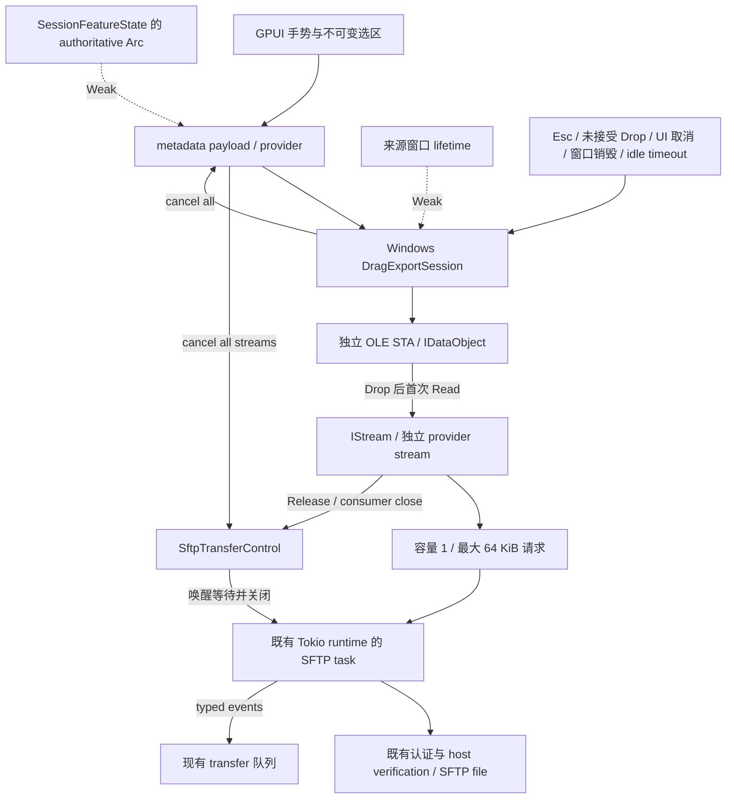

# 远程文件拖拽下载：Windows 第一阶段

本轮实现 Windows 本地文件与 SFTP 普通文件的原生拖出，列表选区支持多文件。
采用按需虚拟文件流，不先完整下载到临时目录，不在 payload resolver 或 GPUI
线程执行网络 I/O。Windows 原生数据对象及 SFTP 协议模拟测试已执行；用户已确认拖拽手势和 Explorer 复制界面正常；真实 SSH 的吞吐与最终文件
哈希尚未手动验证。macOS promised-file、Linux 远程暂存降级及树视图
拖出尚未实现，不能把本轮解释为所有平台均已完成。

## 源码检查与原有调用链

起始主仓库依赖是 `nyakang/zed@0544bd292a52fed9718e1ba9739c4ac82c41d223`
和 `nyakang/gpui-kit@04efb01f5c19fbb77c575632c9f09f30aadccc38`。
检查了固定 revision 的真实源码，包括 Windows、macOS、Wayland 和 X11。

原有文件浏览器链路：

```text
entry_row.rs 的 mouse down / move / click
  → browser_selection.rs 的单选、多选与范围选区
  → transfer_paths.rs 的目标路径选择
  → transfer_jobs/transfer.rs::enqueue_sftp_download_job_for_target
  → submit_transfer_blocking_job
  → RemoteFileService::download_remote_path_with_progress_and_path_options
  → SftpService / download_remote_file_bytes
  → DownloadTemporary::prepare_async
  → 分块读取、取消检查、进度
  → 同一目标目录中的 staging / commit_async
```

初始 row 没有 `on_drag` / 外部 payload。选区由 transfer feature 维护，身份键
包含 raw path token，不能用展示路径代替服务器实际字节路径。下载队列复用
`SftpTransferControl`、typed events、冲突 broker 和现有后台作业调度。

`download_path.rs` 已有文件名与目录边界校验、符号链接及 Windows reparse-point
检查、临时文件清理与提交；普通下载继续使用这些契约。现有 russh-sftp fork
支持 `File::read_at(offset, length)`，因此无需整文件 reader 或 `block_on`。
普通下载和拖出现在共用带暂停、取消和 60 秒超时的 `read_transfer_range`。

GPUI 原有链路：

```text
on_drag → ExternalDragPayloadSource
  → 指针离开来源 viewport
  → promote_external_drag_to_platform
  → resolver.take()（每次手势最多一次）
  → PlatformWindow::can_start_external_drag / start_external_drag
```

起始版本 macOS 用 AppKit 的 NSURL/NSDraggingItem，Wayland 提供真实本地文件
URI；Windows 和 X11 没有 outbound file drag。已有 incoming Windows CF_HDROP
并不等于支持 outbound drag。

## 最终接口与分层

`nyaterm-transport::drag_export` 定义 `DragExportSource::Local` 和
`RemoteDragFile`，后者只包含展示名称、可选大小、真实 `RemoteFilePath` 与修改
时间，没有本地目标路径或凭据。传输实现与 GPUI 无关。

GPUI 添加：

```rust
ExternalDragPayload::VirtualFiles(VirtualFileDragPayload)
VirtualFileDescriptor { name, size, modified_at, provider }
VirtualFileProvider::open() -> io::Result<Box<dyn VirtualFileStream>>
VirtualFileProvider::cancel()
VirtualFileStream::read_at(offset, buffer)
VirtualFileStream::cancel()
```

provider 的 `open` 仅安排后台任务；平台 worker 才调用同步 `read_at`。每个
stream 有容量 1 的 Tokio 请求队列和容量 1 的同步回复队列，单次内容请求
最多 64 KiB；后台 SFTP 分块大小复用下载设置，使用有界预读而非完整文件缓存。
Tokio 任务在既有 SSH multiplex runtime 或
共享兼容 runtime 读取 SFTP，保留兼容会话 gate、host verification、路径编码、
暂停、取消和超时。每个 provider 最多同时打开 16 个 stream。

`DraggedSelection → TransferDragExportService → ExternalDragPayload` 隔离业务
与平台映射。手势开始即固定 session、backend、选中 entry 及来源服务的 Weak
引用；切换标签页、更改选区、断线重连均不能重定向旧手势。列表普通文件可
首次按住直接拖出；Ctrl/Shift 等修饰键继续用于选区，GPUI 新 `can_drag` predicate
避免消费这些手势。树视图尚未接入。

## 各平台映射

| 平台 | 本地文件 | 远程普通文件 | 本轮状态 |
| --- | --- | --- | --- |
| Windows | `CF_HDROP` → `IDataObject` → `DoDragDrop` | `FileGroupDescriptorW` + indexed `FileContents` → `IStream` | 已实现；用户确认拖拽正常，性能与文件完整性待手动对比 |
| macOS | 保留 AppKit NSURL 原生 drag | 尚未实现 `NSFilePromiseProvider` | UI 提示使用现有下载 |
| Wayland | 保留真实本地路径 URI native drag | 尚未实现显式本地 staging 准备流程 | UI 提示使用现有下载 |
| X11 | 原有 GPUI outbound unsupported | unsupported | 不伪造本地路径 |

Windows OLE 使用独立 STA，GPUI 线程不进入可能同步请求内容的 `DoDragDrop`。
2026-10-07 补上 STA 与来源窗口的输入队列交接：仅手势期间关联队列，在
AttachThreadInput 重置键状态后恢复来源快照，拖拽结束立即解关联，并在来源
窗口完成消息中校正当前按键。原生导出诊断只记录 HRESULT/effect。
`IDataObject` 提供 metadata/HGLOBAL，按 `lindex` 提供独立 `IStream`，支持
SET/CUR/END seek、Clone 重开、Stat 和有界 CopyTo。hover 的 Read 返回
`E_PENDING`，不打开内容；鼠标释放进入原生 Drop 后才允许内容请求。
实现 `IDataObjectAsyncCapability`，原生拖拽结束后 STA 继续泵消息，直到目标
释放数据对象/stream 或取消。来源窗口 marker 支持重新进入原窗口，不冒充
实际本地文件；带窗口 validation number 的完成消息清理 GPUI 悬挂手势。

## 生命周期与取消



- GPUI entity 不由 COM 长期持有；metadata provider 只持有服务 Weak。
- stream 拥有请求 sender、任务 handle 和取消 control。Drop 取消；不在 UI
  join 任务。底层取消等待每 25 ms 检查，远端文件/session close 各限制 5 秒。
- native session 使用 Weak window lifetime，独立弱引用 watcher 能在同步
  Read 等待期间取消。目标持续五分钟不活动会取消；持续读的大文件没有总时限。
- 首次真实 read 才发 `DragExportOpened` 创建队列条目。每次重复 open 有独立
  job/control；可复用队列暂停与取消。reader 的区间覆盖统计避免 seek 到 EOF
  就误报整个文件完成，也避免重复读取重复累计字节。
- 拖拽取消且未读取时不建立 SFTP 传输。consumer 提前关闭且内容不完整时失败/
  取消；服务器文件缺失、类型或大小变化、短读及网络失败返回原生错误。
- `Completed` 表示所有内容已提供给原生目标，不表示 OS 已成功保存最终文件。
  队列不提供假的“打开本地目标”或“重试到旧路径”。

## 安全与兼容性

所有 virtual name 在 native advertisement 前校验，拒绝 traversal、分隔符、
ADS、控制字符、尾部点/空格、Windows 保留设备名（含 COM¹/LPT² 等）、超长
UTF-16 名及大小写重复名。选区含远程目录、symlink 或特殊文件时整体拒绝；
底层再次 lstat 并验证打开的普通文件和广告大小。服务器可同时修改文件，
因此这些检查不构成文件内容快照，无法保证同大小的原地修改不可见。

Windows 最终文件与冲突处理属于 Explorer/原生目标；NyaTerm 不知道 destination，
不使用 `DownloadTemporary` 写入它。读取错误返回 `STG_E_READFAULT`，取消返回
失败，不把缺失字节当成成功；目标软件如何处置其 partial file 属于目标行为，
本轮没有声称 NyaTerm 能替目标保证 atomic commit。普通 Download 的目标安全、
冲突策略和 staging 提交继续使用既有逻辑。

未修改配置、credentials、redb schema、backup 或 sync 数据契约。没有新增
secret 日志，provider Debug 不展开传输对象；传输服务副本仅供正在运行的
后台任务使用，取消与有界 cleanup 后释放。

## 修改文件与依赖

主仓库：

- `Cargo.toml`、`Cargo.lock`：只固定两个 fork 新 revision，保留原有 registry
  依赖解析，移除验证期间临时 path override 的解析影响。
- transport：`src/drag_export.rs`、`src/sftp/export_reader.rs`、其 `tests.rs`，
  `src/sftp/mod.rs`、`filename_tests.rs`、`src/remote_file/mod.rs`、`src/lib.rs`。
- desktop：`features/transfers/drag_export.rs`、`mod.rs`、`transfer_events.rs`、
  `transfer_widgets.rs`、`models/transfers.rs`；session `mod.rs`/`state/mod.rs`；
  browser `view.rs`、`entry_row.rs`、`browser_selection.rs`、`drag_preview.rs`、
  `panel.rs` 回归测试与对应 module 声明；队列 helpers
  `job_row.rs`、`queue.rs`；EN、简中、繁中、日语、韩语和法语 locale。
- 本说明。主仓库实现保持未提交，可直接审阅 diff。

fork 的变更在可编辑的独立 worktree，未改动 `temp/vendor`：

| fork / 分支 | 提交 | 关注点 |
| --- | --- | --- |
| [nyakang/zed / nyaterm](https://github.com/nyakang/zed/tree/nyaterm) | `05e51428ff` | GPUI abstraction、predicate、core tests、macOS/Wayland guards |
| 同上 | `164d61d92987889e8c3dedf21ae63d9240a4306e` | Windows native export、mock tests、生命周期与事件 |
| [nyakang/gpui-kit / nyaterm](https://github.com/nyakang/gpui-kit/tree/nyaterm) | `20381da707abb77b4f23658a245a563ec9cdf2e4` | 所有 Zed dependency 使用同一 revision |
| nyakang/zed / nyaterm | `cb076022f2`、`d7efcc2708a0f95418a0484318fb180b22adb5bf` | STA 输入交接与格式修正；后者为当前固定 revision |
| nyakang/gpui-kit / nyaterm | `61bb5bd88d811e5c7116941f8009a19b9747e8b5` | 跟随输入交接 revision；当前固定 revision |

两个 fork 已推送，并在各自 `NYATERM.md` 记录原因、验证和限制。Zed README
原本已存在其 `.rules` 要求的人工 review marker，本轮保留。

## 验证

环境：Windows，PowerShell，固定 Git 依赖。

| 命令 / 范围 | 结果 |
| --- | --- |
| fork `cargo check -p gpui -p gpui_windows` | 通过 |
| fork `cargo test -p gpui --features test-support virtual --lib` | 4 项通过 |
| 既有 `file_drag_is_promoted_once_and_restored_in_source_window` | 通过 |
| fork `cargo test -p gpui_windows --features test-support external_drag_tests --lib` | 10 项通过，本地 mock provider 与 Win32 输入队列交接 |
| fork GPUI/Windows/macOS/Linux 包格式检查 | 通过 |
| transport bounded bridge 测试 | 1 项通过 |
| transport export_reader 协议模拟与区间覆盖测试 | 6 项通过 |
| 主仓库 `cargo check --workspace --locked` | 通过 |
| 主仓库 `cargo test --workspace --locked` | 通过：3454 passed、15 ignored、0 failed（含文档测试与 helper lifecycle） |
| 主仓库 `cargo fmt --all -- --check` | 通过 |
| 主仓库 `cargo clippy --workspace --all-targets --locked` | 通过，最终运行无警告 |
| 主仓库 `cargo build --workspace --locked` | 通过 |
| Explorer、桌面、真实 SSH 服务器的手动拖放 | 未验证 |
| macOS/Linux 编译与运行 | 未验证 |

新增 desktop 测试覆盖 local → Files、remote → VirtualFiles、选区顺序、raw
path metadata、unsafe name、整组选区含目录/链接时拒绝、unsupported platform、
不可重定向快照，以及导出条目不提供本地目标/重试。Windows mock 覆盖多文件、
Unicode、空文件、分块读取、EOF、错误、取消、seek/Clone、hover、来源 marker
与最终 Release。SFTP mock 在真实协议字节层检查实际 raw path、读取边界、
取消、不完整 consumer close、来源 owner 销毁和兼容 gate 清理。

初次 workspace 测试发现新增提示缺少 JA/KO/FR，导致两项语言目录一致性测试
失败；已补齐全部六种语言，重新执行时这两项检查通过。

## 2026-10-07 拖动无反馈修复

用户在新编译的列表视图中反馈：选中普通远程文件后拖动没有效果。修复三处：

- 原先 `on_drag` 返回 `gpui::Empty`，窗口内不会显示拖拽预览。现在由独立
  `drag_preview.rs` 渲染跟随指针的文件名和多选数量，使用现有 theme/icon。
- 不再按“上一帧是否已选中”决定挂载监听，首次按住文件名并移动也能开始；
  仍排除重命名、修饰键、远程目录与不支持的平台。
- 原生 STA 不曾收到来源线程的鼠标按下消息，缺少 foreground input handoff。
  现在显式关联输入队列并恢复初始键状态，解关联后校正来源键状态，避免立即
  将仍按住的左键当作松开。内容 provider 与后台 SFTP 架构保持原契约。

新增真实文件行 UI 回归覆盖本地/远程列表中的首次按住文件名拖动、可见预览和
多选保持；原生测试覆盖真实两线程的 Win32 输入队列关联、键状态与清理后
重新关联。Windows native mock suite 为 10 项，GPUI core suite 为 4 项。
最终固定依赖的 workspace 测试为 3444 passed / 14 ignored / 0 failed，Clippy
无警告，格式检查与 workspace 可执行文件构建通过。真实 Explorer 拖放仍需要
用户验收。

## 2026-10-07 并发预读优化

拖拽性能现在复用现有 `sftp_transfer_options()` 的下载并发数和缓冲区大小，
在手势开始时保存不可变配置快照。`SftpReadSource::with_transfer_options` 是
新增 builder；既有 `new` 保留，默认配置保持 3 路 / 64 KiB。其他下载选项
不会替原生目标处理重名、落盘、续传或重试。兼容模式继续强制 1 路。

transport 的 `export_reader/prefetch.rs` 在同一个远端文件句柄上调度范围读取，
使用任务内的 `FuturesUnordered`，不会创建额外 SSH 连接或 detached 预读任务。
首个内容请求后才启动，等待下一个原生请求期间继续推进。缓存和在途分块总数
最多 2N；默认数据窗口为 384 KiB，最大配置为 5 MiB，另有最多 64 KiB 回复。
这些是分块数据窗口的预算，不包含 SSH/SFTP 协议解码与分配器的瞬时开销。
每个 stream 独立执行该上限，所有 stream 不共享一个全局 5 MiB 预算。

小请求复用缓存，跨块读取按需要拼接；窗口外 seek 丢弃旧 futures 和缓存后
重建。SFTP 短 DATA packet 继续读取到所需块末尾，提前 EOF 返回失败；预读
错误保存在对应块中，消费该块才报错。metadata 大小未知时降级单路、单块
按需缓存，不向未知 EOF 之外并发预读。缓存交付也遵守暂停和取消，退出时
释放预读状态，沿用原有远端关闭与兼容 gate 清理。

进度只统计成功发送给消费者的范围；预读不会提前增加进度，重复读取与 seek
不会重复统计或误报完成。完成仍只代表内容交付，不代表 Explorer 已提交磁盘文件。
本次不更改 GPUI fork、依赖 revision 或任何持久化格式。

新增 scheduler 测试用可控响应证明：首个响应到达前已有 3 个请求在途，逆序
响应仍返回正确数据；同时覆盖窗口上限、小请求、跨块、seek、未知大小、延迟
错误、暂停/恢复、取消以及旧 futures 释放。真实 SFTP 字节协议模拟覆盖设置
传递、兼容单路、短包补齐、metadata 无大小、后台填充和交付进度分离。

手动性能测量可重复执行：

```powershell
cargo test -p nyaterm-transport --locked drag_prefetch_latency_benchmark --lib -- --ignored --nocapture
```

测试使用 50 MiB 数据和真实 SFTP 模拟 peer，每个 READ 响应独立延迟 50 ms。
基线按旧路径串行取 64 KiB；优化路径使用默认配置和真实同步消费桥。两份
数据 SHA-256 一致。测量不作为依赖墙钟时间的 CI 断言。

| 模拟测量 | 耗时 | 吞吐 | 最大在途 READ |
| --- | --- | --- | --- |
| 串行基线 | 50.202 s | 0.996 MiB/s | 1 |
| 并发预读 | 16.751 s | 2.985 MiB/s | 3 |

本机此次模拟提升约 3.00 倍。它不包含真实 SSH 网络、服务器负载或 Explorer
写盘，不能据此保证用户环境相同倍数；真实 Windows SSH / Explorer 对比尚未执行。
本次 `cargo check --workspace --locked`、`cargo test --workspace --locked` 与
格式检查通过。完整测试最终为 3454 passed / 15 ignored / 0 failed；新增的
ignored 项是上述手动性能测量，已单独执行通过。首轮完整测试中既有
`windows_local_session_close_releases_conpty_reader` 出现 5 秒超时；未修改该
测试或终端实现，单项重跑和原命令完整重跑均通过。最终 Clippy 无警告，
`cargo build --workspace --locked` 通过，包含主程序与 helper。

## 后续验收与平台工作

先在 Windows 用真实本地 mock/SSH 文件手动验收 Explorer、桌面、拒绝文件的
目标、Esc、Explorer 取消、断线、多选与大文件，特别验证独立 STA 的输入及
异步 Shell 消费行为；单元测试不替代真实 OLE 手势验收。

macOS 后续需要 `NSFilePromiseProvider` 的 destination URL 和 completion
回调适配，并在目标目录使用现有安全 staging/atomic commit 策略。Linux 后续
应提供明确的“准备本地文件”操作和暂存资源寿命，完成后再允许 native Files
drag；不在 resolver 中等待。X11 保持 unsupported，直至其平台 adapter 提供
真实协议。远程目录递归与树视图接入另行实现。
